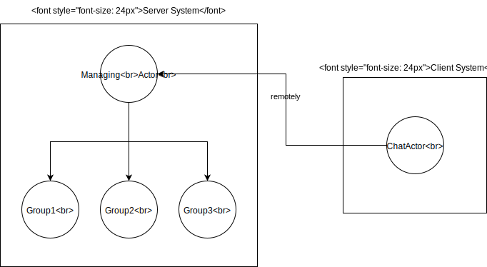

#### Advanced Topics in Distributed and Reactive Programming: Assignment 2 

#### Actor Model Design
Our akka system is comprised of 3 main actors: A ChatActor, a GroupActor, and a ManagingActor.

##### ChatActor

The ChatActor is the actor representing a chat user in our app. It communicates with other ChatActors in order to send them messages, and with the ManagingActor in order to get relevant information for communication with other users, and in addition, to authenticate in the connection process.

The ChatActor is created in a system on the local computer of the client, and it connects remotely to the ManagingActor according to a pre-define address.

The UserCLI class is handling the input and output of the client. When a new command is received as input, a control-message is delivered to the local ChatActor, which then handles it according to its type. 

##### ManagingActor

The ManagingActor is responsible for managing users and groups. To this end, it keeps both a map which keeps all the usernames that are currently connected to it, and their respective ActorRefs, and a list of group-names and their respective ActorRefs.

##### GroupActor

The GroupActor is responsible for handling relevant information about a single group. It keeps a record of who is the admin of the group, who are the co-admins, muted-users, etc.

It is created in the same system as the MangingActor, so that each GroupActor is a child of ManagingActor.

The GroupActor uses a router in order to broadcast the messages sent to the group to all the members of it.

#### Hierarchy

#### Messages

We divided the messages to 4 classes: ChatActorMessages, GroupActorMessages, ManagingActorMessages, UserCLIControlMessages.

As a rule of thumb, we put each message in the receiving actor's class.

##### ChatActorMessages

<u>ManagingMessage</u> - 
A message that is printed in the client, which contains information about actions that has been done, or about errors that have come up during the process

<u>FileMessage</u> - 
A message containing a binary information. When a ChatActor receives it, it retrieves the binary information from the message and saves it to a temporary location on the client's computer

<u>TextMessage</u> - 
A message containing text from another user. The ChatActor handles it by printing the text it contains

<u>GroupTextMessage</u> - 
A message containing text message sent via a group from a certain user. The ChatActor prints this message when receiving it.

<u>GroupFileMessage</u> - 
A message containing a binary information sent via a group from a certain user.
The ChatActor saves the binary information to a temporary file in each member's computer,
and prints the location it is saved to.

<u>JoinGroupRequestMessage</u> - 
A message representing an invitation to a group.
This message is stored in a stack in the ChatActor, which enables him to
receive several invitations simultanously, and answer each one after the other.

<u>JoinGroupAcceptMessage</u> - 
A message representing a positive answer to a group invitation.
When a ChatActor receives it, it forwards it to the managing server,
and sends the invitee a welcome message

##### GroupActorMessages
All the GroupActor messages sent from the ChatActor are first delivered to the ManagingActor and then forwarded to the GroupActor.

<u>AddCoAdminMessage</u> -
A message received when a user tries to add a co-admin to the group.
The group should authenticate the user by its username and verify that
he has permission to do so, and act accordingly.

<u>RemoveCoAdminMessage</u> -
A message received when a user tries to remove a co-admin from the group.
The group should authenticate the user by its username and verify that
he has permission to do so, and act accordingly.
     
<u>CreateGroupMessage</u> -
A message received from a user willing to create a new group.
The message contains the username which will act as the group admin

<u>LeaveGroupMessage</u> -
A message received when a user is willing to leave the group.
After handling the message, the requesting user should no longer be
a member of the group, meaning he will no longer be an admin/co-admin or muted,
and he will not be able to send or receive messages from the group

<u>ValidateInviteMessage</u> -
A message received from a user willing to validate that he has permission
to invite a new user to the group and sending him a group invitation request.
It means that he should be an admin or a co-admin, and that the invitee
should not already be in the group

<u>RemoveUserMessage</u> -
A message received from an admin or a co-admin willing to remove a member
of the group from the group.
     
<u>MuteUserMessage</u> -
A message received from an admin/co-admin willing to mute another member
of the group. The message contains the time the other member should be
muted for in seconds, and once the time is up, the member is automatically
un-muted. Once muted, a user can't send messages to the group

<u>AutoUnmuteMessage</u> -
A message received by the scheduler of the GroupActor set when an
MuteUserMessage is received. The scheduler sends the message after
the mute-time is over automatically.

<u>UnmuteUserMessage</u> -
A message received from an admin/co-admin willing to un-mute a member
of the group. Once the member is un-muted, he can send messages to the group.

##### ManagingActorMessages

<u>UserConnectMessage</u> -
A message received by a user willing to connect to the server.
The server should verify that the username is not taken by any
other user, and then send a message confirming the connection.

<u>UserDisconnectMessage</u> -
A message received by a user willing to disconnect from the server.
The user's information should be discarded entirely. Each group that
included the user should be informed and delete any record of the user.
The server sends a notification indicating a successful disconnect.

<u>FetchTargetUserRefMessage</u> -
A message received by a user, requesting the ActorRef of another,
already connected, user. This message is sent so that each user will
be able to communicate with other users directly, and not via the server.

<u>GroupDeleteMessage</u> -
A message sent by the GroupActor, in order notify the managing server
of a group that is deleted. The managing server should delete any record of the group,
and allow users to re-create a group with the same name.

##### UserCLIControlMessages

The messages correspond to the commands available for the user.
The code contains documentation which shows for each message the corresponding command.
